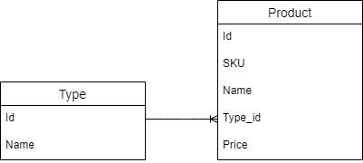

# Тестовое задание Xsolla School 2021. Backend
Для решения задачи был использован язык **JavaScript (Node.js)**,
фреймворк **Express**, 
работа с БД реализована через ORM **Sequelize**, 
в качестве системы управления БД выбран **PostgreSQL**.

## Приступая к работе
Необходимо установить Node.js.

В качестве системы управления базами данных используется PostreSQL, 
поэтому для успешного запуска проекта необходимо также установить PostreSQL. 

После установки создайте БД, ее имя нужно передать в файл окружения (.env).

В файле .env (папка server) заданы переменные окружения:
* Порт, на котором мы разворачиваем наш проект;
* Имя базы данных;
* Имя пользователя Postgres;
* Пароль пользователя Postgres;
* Хост (localhost);
* Порт (5432).

Укажите в этом файле имя БД, которое было использовано при создании, а
также свой пароль пользователя Postgres.

Необходимо выполнить команду **npm install**, 
в результате установятся все необходимые зависимости приложения
(express, pg, pg-hstore, sequelize, cors, dotenv).

## Запуск
**npm run start** запускает приложение.

**npm run dev** запускает приложение в режиме разработчика с использованием nodemon.

## Локальное тестирование API
После запуска приложения в БД автоматически создатся 2 таблицы:
* Product (информация о товаре);
* Type (информация о типе товара).

### Методы API для Type:

* POST-запрос (http://localhost:5000/api/type/) создает новый тип товара, 
  в теле запроса передаётся название добавляемого типа (**"name"**);
    
* GET-запрос (http://localhost:5000/api/type/) возвращает всю информацию о типах товара;

* GET-запрос (http://localhost:5000/api/type/:id) возвращает информацию 
  о типе товара по указанному идентификатору;
  
### Методы API для Product:

* POST-запрос (http://localhost:5000/api/product/) создает новый товар,
  в теле запроса передаётся SKU добавляемого товара (**"sku"**),
  название (**"name"**), цена (**"price"**), 
  идентификатор типа товара (**"typeId"**);
  
* GET-запрос (http://localhost:5000/api/product/) возвращает всю информацию о товарах. 
  Для снижения нагрузки на сервис товары возвращаются по частям,
  в качестве параметров передаются кол-во возвращаемых товаров - **"limit"** *(по умолчанию 10)*,
  текущая страница - **"page"** *(по умолчанию 1)*. Также предусмотрена фильтрация по типу товара, 
  в этом случае требуется дополнительно передать в параметрах **"typeId"**;
  
* GET-запрос (http://localhost:5000/api/product/id/:id) возвращает информацию
  о товаре по указанному идентификатору;

* GET-запрос (http://localhost:5000/api/product/sku/:sku) возвращает информацию
  о товаре по указанному SKU;
  
* PUT-запрос (http://localhost:5000/api/product/id) редактирует товар по идентификатору, 
  в теле запроса передаются идентификатор товара **"id"**, который подлежит редактированию 
  и редактируемые параметры товара **"name"**, **"typeId"**, **"price"**
  (возможна передача как одного, так и нескольких параметров);
  
* PUT-запрос (http://localhost:5000/api/product/sku) редактирует товар по SKU,
  в теле запроса передаются идентификатор товара **"sku"**, который подлежит редактированию
  и редактируемые параметры товара **"name"**, **"typeId"**, **"price"**
  (возможна передача как одного, так и нескольких параметров);
  
* DELETE-запрос (http://localhost:5000/api/product/id/:id) удаляет товар по указаному
  идентификатору. 
  
* DELETE-запрос (http://localhost:5000/api/product/sku/:sku) удаляет товар по указаному SKU. 